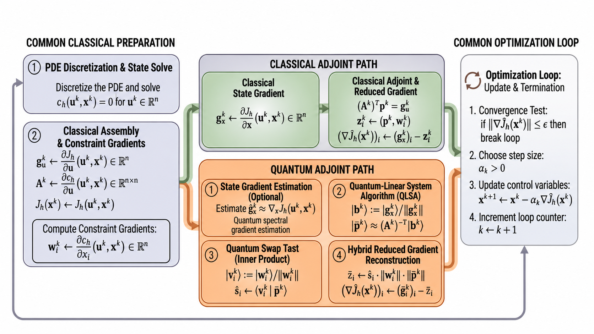
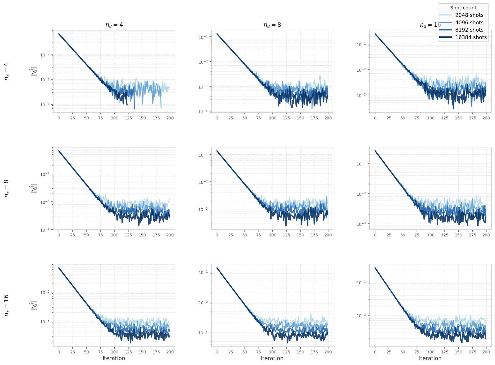
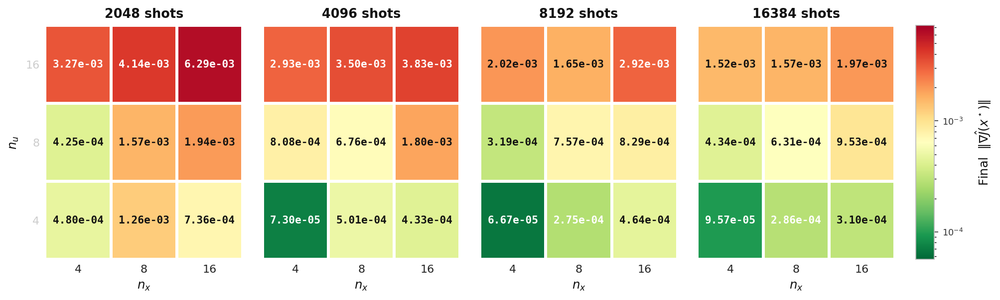
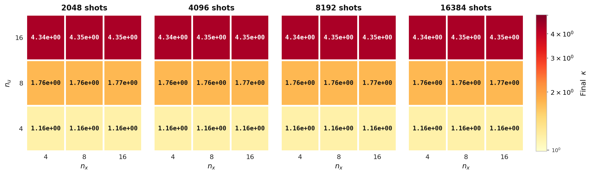

# Hybrid PDECO: Quantum-Accelerated PDE-Constrained Optimization

A hybrid quantum–classical framework for PDE-constrained optimization that replaces the classical adjoint linear solve with a Quantum Linear System Algorithm (HHL).



## Overview

Gradient-based PDE-constrained optimization requires solving an adjoint linear system at every iteration:

$$A^T p = \frac{\partial J}{\partial u}$$

where $A$ is the Jacobian of the PDE residual and $p$ is the adjoint variable. This project embeds the HHL quantum algorithm inside that adjoint solve, keeping the rest of the optimization loop classical. The diagram above shows both the classical and quantum adjoint paths.

**Supported backends:** Aer (Qiskit simulator) · IBM Quantum (real hardware)

## Results

Hybrid solver results on the nonlinear heat equation (Qiskit Aer simulator) across problem sizes $n_x, n_u \in \{4, 8, 16\}$ and shot counts $\in \{2048, 4096, 8192, 16384\}$:

**Gradient norm convergence curves** ($n_u$ columns × $n_x$ rows, varying shot count):



**Final gradient norm** and **final condition number** across the $(n_x, n_u)$ grid:

| Final $\|\|\nabla \hat{J}\|\|$ | Final $\kappa$ |
|:------------------------------:|:--------------:|
|  |  |

## Project Structure

```
project-root/
├── README.md
├── run.py
├── requirements.txt
├── configs/
│   ├── heat_simulator.yaml       # heat equation, Aer simulator
│   ├── elliptic_simulator.yaml   # elliptic equation, Aer simulator
│   └── heat_ibm_real.yaml        # heat equation, real IBM backend
├── assets/                       # diagrams and result figures
└── src/
    ├── classical/
    │   └── classical_solver.py
    ├── models/
    │   ├── elliptic_model.py
    │   ├── elliptic2_model.py
    │   └── heat_model.py
    ├── optimization/
    │   └── optimizer.py
    ├── quantum/
    │   ├── qlsa_solver.py
    │   ├── spectral_gradient.py
    │   └── swap_test.py
    └── experiments/
        ├── elliptic_experiment.py
        ├── elliptic2_experiment.py
        └── heat_experiment.py
```

## Installation

### 1. Create and activate a Conda environment

```bash
conda create -n hpdeco python=3.10
conda activate hpdeco
```

### 2. Install dependencies

```bash
pip install -r requirements.txt
```

### 3. Install QLSAs

This project uses the [QLSAs](https://github.com/QCOL-LU/QLSAs) framework for the HHL implementation. Clone and install it in editable mode:

```bash
git clone https://github.com/QCOL-LU/QLSAs.git
cd QLSAs && pip install -e . && cd ..
```

## Running

```bash
python run.py configs/heat_simulator.yaml
```

Pass any config file from `configs/` as the argument. The experiment type, model, backend, and output path are all controlled by the YAML.

## Supported Backends

| Backend | `backend_mode` | Notes |
|---------|----------------|-------|
| Qiskit Aer (simulator) | `aer` | Default; no credentials needed |
| IBM Quantum (real hardware) | `ibm` | Set `ibm_backend_name` or use `ibm_use_least_busy: true` |

Set the backend in the config:

```yaml
quantum:
  backend_mode: ibm   # or aer
  shots: 4096
  ibm_backend_name: null   # set a specific backend name, or leave null to use least busy
  ibm_use_least_busy: true
```
